# Eternals Studio — System Communication & Visual Architecture Guidebook

> **Audience**: Core Developers, Systems Architects, and Technical Maintainers  
> **Repository**: `nominoom/EternalsStudio`  
> **Framework**: Next.js 16 (Turbopack, App Router, React 19)

---

## 1. High-Level System Architecture & Global Communication Hub

Eternals Studio combines a client-facing digital marketplace, bespoke custom design request portal, collaborative team operations board, and administrator control panel. The system interfaces with **six primary external third-party services** alongside a centralized **Supabase PostgreSQL** database.

### 🌐 Global Communication Topology

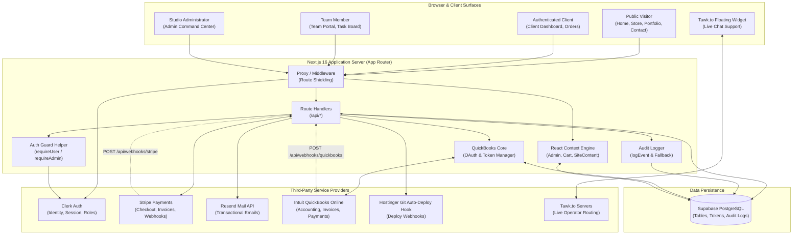

---

## 2. Third-Party Integration Matrix

| Third Party | Purpose | Inbound Touchpoints | Outbound Touchpoints | Auth / Credentials Required | Fallback / Bypass Behavior |
|---|---|---|---|---|---|
| **Clerk** | User Authentication, Session Management, Role RBAC (`admin`, `team`) | Session Tokens, Client JWTs, `<SignIn />` / `<SignUp />` | `currentUser()` server lookup, user role verification via `publicMetadata` | `NEXT_PUBLIC_CLERK_PUBLISHABLE_KEY`, `CLERK_SECRET_KEY` | None (hard dependency for protected routes; 401/403 returned if invalid) |
| **Supabase** | Primary relational PostgreSQL data store, audit logs, file attachments | Real-time queries, REST/PostgREST data fetching | Table Inserts, Updates, Soft-deletes, Upserts | `NEXT_PUBLIC_SUPABASE_URL`, `NEXT_PUBLIC_SUPABASE_ANON_KEY`, `SUPABASE_SERVICE_ROLE_KEY` | In-memory mock arrays, local storage fallbacks, console warning logs |
| **Stripe** | Payment gateway, checkout sessions, custom quote invoices | Inbound webhooks (`checkout.session.completed`) | Checkout session creation, line item queries | `STRIPE_SECRET_KEY`, `NEXT_PUBLIC_STRIPE_PUBLISHABLE_KEY`, `STRIPE_WEBHOOK_SECRET` | Non-production mock payment verification (`/api/checkout/verify-mock`) |
| **Resend** | Transactional email delivery for quotes, receipts, contact inquiries | None | Client invoice notifications, quote confirmations, admin direct replies | `RESEND_API_KEY`, `ADMIN_EMAIL` | Console logging bypass; transaction execution continues without throwing |
| **Intuit QuickBooks** | Cloud bookkeeping, invoice synchronizing, payment reconciliation | Inbound CDC Webhook notifications (`/api/webhooks/quickbooks`) | OAuth 2.0 code exchange, proactive token refresh, invoice/payment queries | `QUICKBOOKS_CLIENT_ID`, `QUICKBOOKS_CLIENT_SECRET`, `QUICKBOOKS_ENVIRONMENT`, `QUICKBOOKS_WEBHOOK_VERIFIER` | Database storage of refresh tokens in `quickbooks_tokens`; graceful failure logging |
| **Hostinger** | VPS / Cloud Web Hosting, Git Auto-Deployment Webhooks | Inbound webhooks (`/api/webhooks/stripe`, `/api/webhooks/quickbooks`) | HTTP POST to Hostinger Auto-Deploy Webhook (`HOSTINGER_DEPLOY_HOOK_URL`) | `HOSTINGER_DEPLOY_HOOK_URL` | Audit event written to `system_events` with Hostinger deployment status |
| **Tawk.to** | Real-time customer support live chat | Client-side WebSocket to Tawk edge | Client-side script injection | Embed script ID (`s1.src = '...'`) | Collapsed floating widget with manual open/close and draggable state |

---

## 3. Core Authentication & Authorization Architecture

Authentication is centralized in [`src/lib/auth.ts`](file:///c:/Users/stnoo/Downloads/EternalsStudio/src/lib/auth.ts) and evaluated before any business logic executes in route handlers.

### 🔐 Route Protection & Role Verification Flow

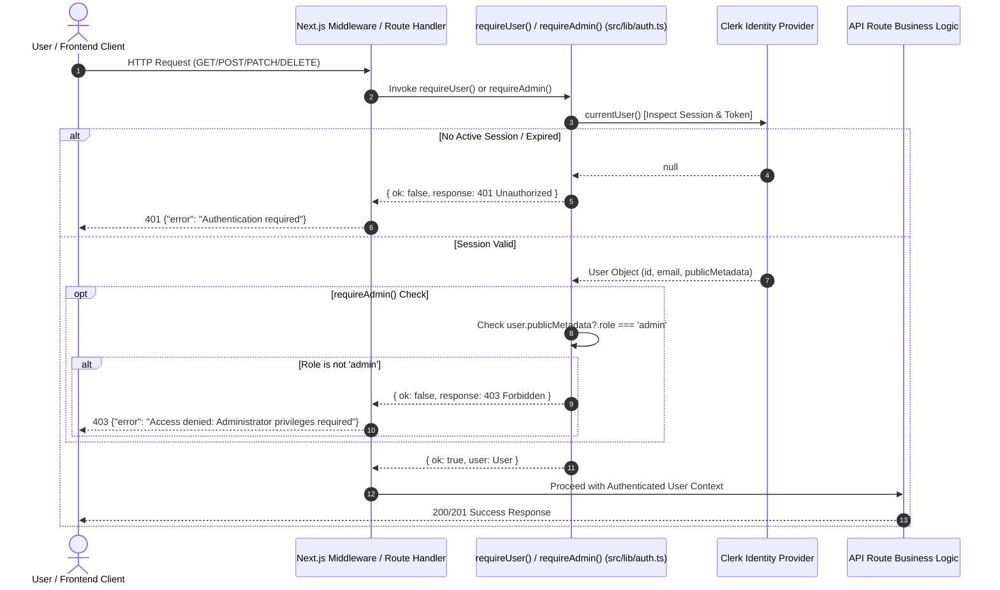

### Role Matrix & Access Hierarchy

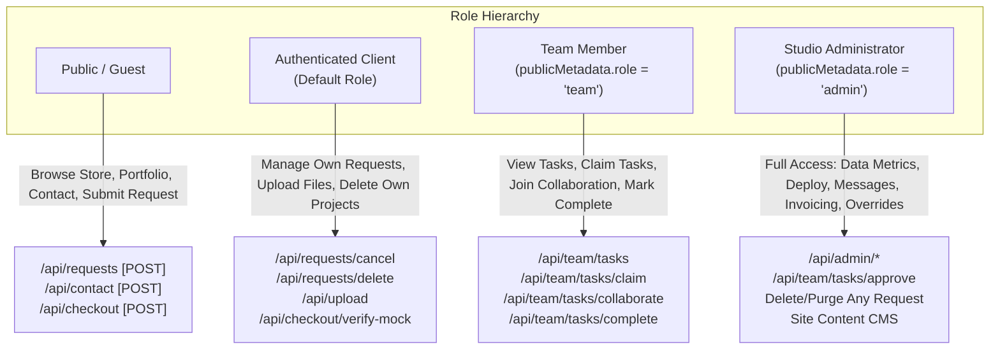

---

## 4. Subsystem Architectures & Function Life-Cycles

---

### Subsystem A: Client Project Request Lifecycle

Handles custom client specifications from initial submission through approval, team delegation, and delivery.

#### 1. Lifecycle State Machine

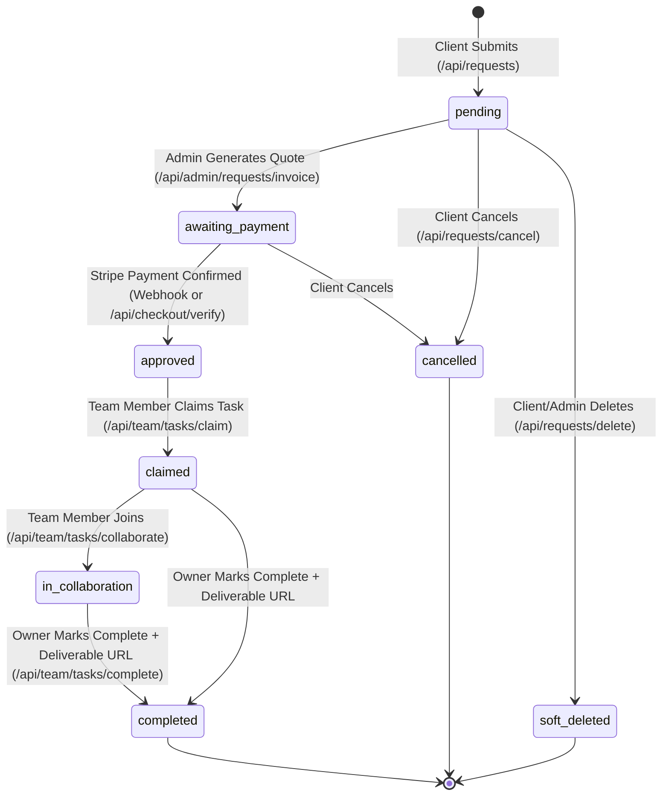

#### 2. Detailed Communication Flow: Project Request Creation

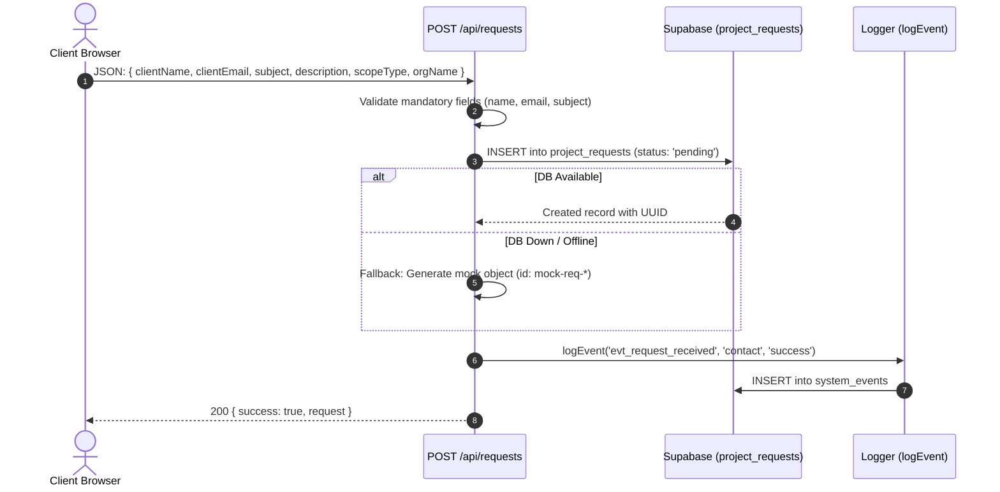

#### 3. Detailed Communication Flow: Request Cancellation & Deletion

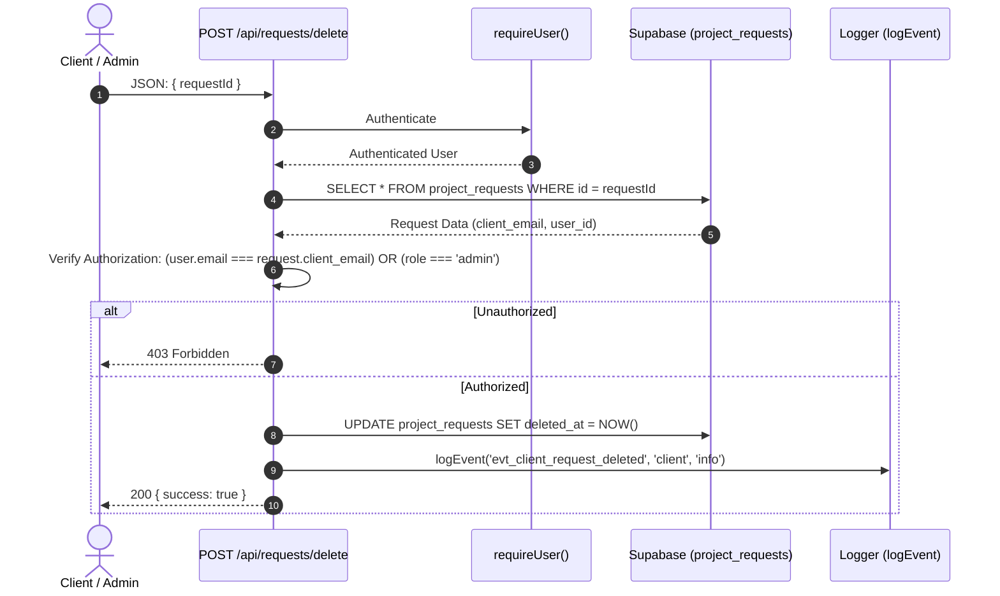

---

### Subsystem B: Admin Operations & Delegation

The Admin command center gives administrators real-time visibility, automated invoice quotation, and CI/CD deployment capabilities.

#### 1. Admin Data Metrics Aggregation (`/api/admin/data`)

```mermaid
flowchart TD
    Admin[Admin Browser] -->|GET /api/admin/data| RouteHandler[Route Handler]
    RouteHandler -->|1. Validate| AuthGuard{requireAdmin}
    AuthGuard -->|Rejected| Denied[401/403 Response]
    AuthGuard -->|Approved| ParallelFetch[Parallel Data Aggregation]

    subgraph ParallelFetch["Supabase Queries (Promise.all)"]
        Q1["orders.select(*).order(created_at)"]
        Q2["project_requests.select(*).order(created_at)"]
        Q3["contact_messages.select(*).order(created_at)"]
        Q4["system_events.select(*).order(created_at)"]
    end

    ParallelFetch --> StatsEngine[Metrics Engine]
    
    subgraph StatsEngine["Computed Analytics"]
        S1["Total Revenue = SUM(orders.total_amount)"]
        S2["Active Orders Count"]
        S3["Pending Requests Count"]
        S4["Unread Contact Messages Count"]
    end

    StatsEngine --> Response[Return JSON: { stats, orders, requests, messages, auditLogs }]
    Response --> Admin
```

#### 2. Invoice Quote Generation & Email Pipeline (`/api/admin/requests/invoice`)

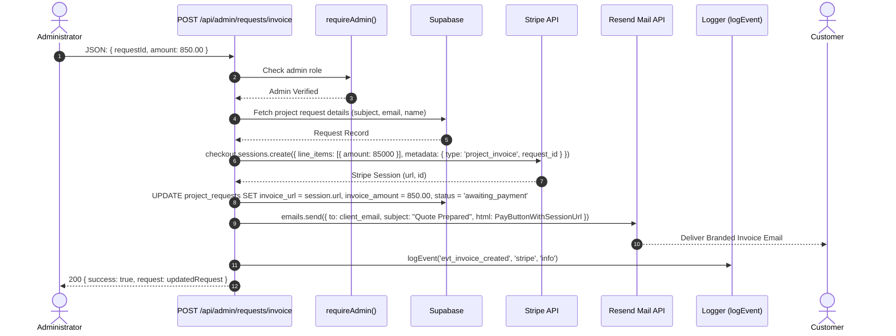

#### 3. Production Deployment Pipeline (`/api/admin/deploy`)

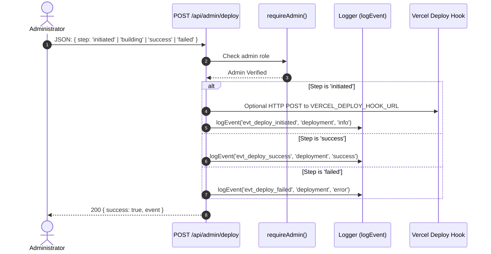

---

### Subsystem C: Team Collaboration Portal

Allows designated team members (`publicMetadata.role === 'team' | 'admin'`) to claim tasks, collaborate across multiple designers, and mark completed jobs for automatic customer delivery.

#### Collaborative Workflow Architecture

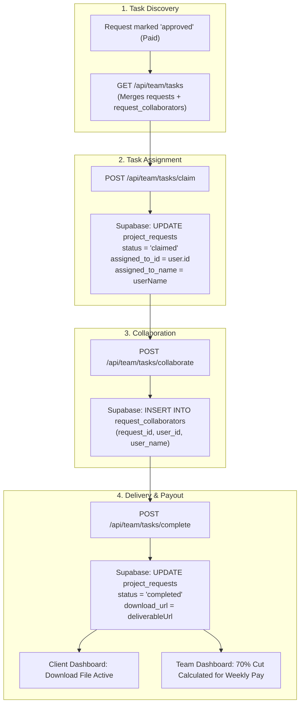

---

### Subsystem D: E-Commerce Store, Cart & Stripe Payments

Handles digital store items, exclusive 1-of-1 assets, cart persistence, checkout generation, and payment webhooks.

#### 1. E-Commerce Purchase Flow

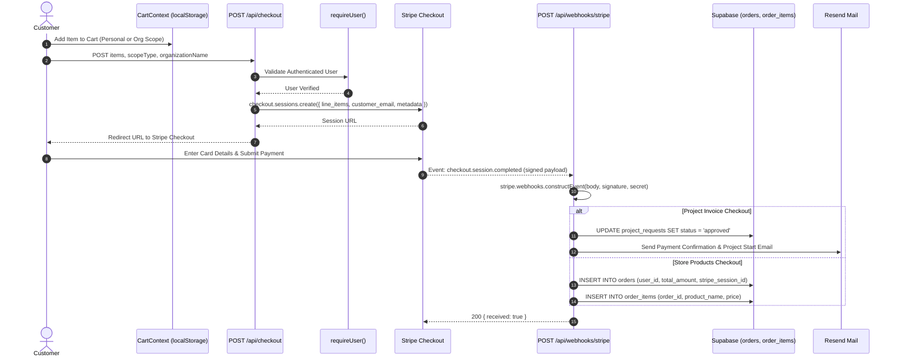

#### 2. Mock Payment Sandbox Guard (`/api/checkout/verify-mock`)

To protect production accounting while allowing frictionless local offline testing, mock verifications are strictly fenced:

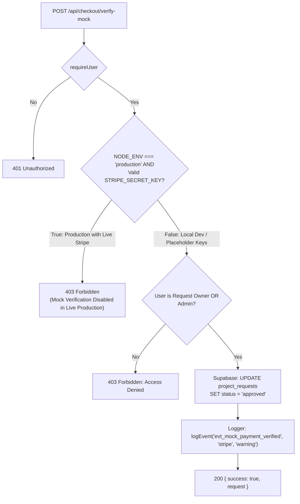

---

### Subsystem E: Intuit QuickBooks Accounting Synchronization

Provides automated synchronization between Eternals Studio orders and Intuit QuickBooks Online chart of accounts.

#### 1. OAuth 2.0 Authorization & Refresh Lifecycle

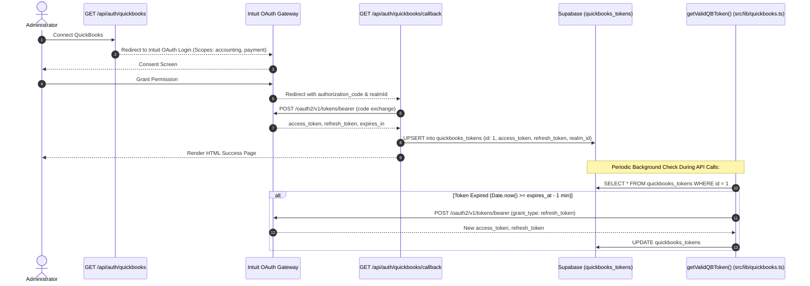

#### 2. Inbound QuickBooks Webhook Listener (`/api/webhooks/quickbooks`)

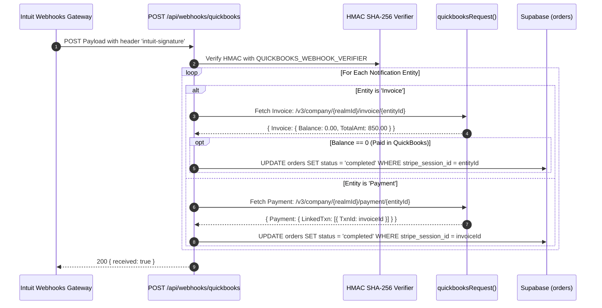

---

### Subsystem F: Contact Inquiries & Live Support

Connects prospective customers with the studio through asynchronous contact forms and real-time live chat.

#### Communication Flow: Public Contact Inquiries

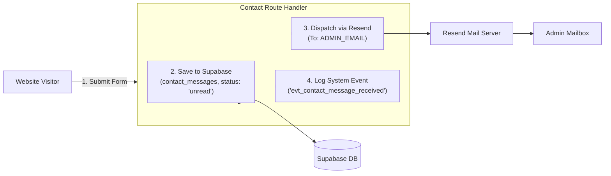

---

### Subsystem G: Centralized Audit Logging Engine (`src/lib/logger.ts`)

Every state-altering event (payments, uploads, deletes, quotes, claims, deployments) passes through a fault-tolerant logging pipeline.

#### Fault-Tolerant Event Dispatcher

```mermaid
flowchart TD
    Caller[Calling Function / API Route] -->|logEvent(key, category, status, message, meta)| Engine[Logger Core]
    Engine --> TryDB[Attempt Write to Supabase: system_events]
    
    TryDB -->|Success| DBWritten[Record Persisted to PostgreSQL]
    DBWritten --> ReturnEvent[Return SystemEvent]
    
    TryDB -->|DB Error / Table Missing / Timeout| Fallback[Console Interceptor fallbackLog]
    
    subgraph Fallback["Console Interceptor"]
        CheckStatus{status}
        CheckStatus -->|'error'| CError["console.error([EVENT][CAT][ERR] ...)"]
        CheckStatus -->|'warning'| CWarn["console.warn([EVENT][CAT][WARN] ...)"]
        CheckStatus -->|'info' / 'success'| CLog["console.log([EVENT][CAT][INFO] ...)"]
    end

    Fallback --> ReturnEvent
```

---

## 5. Master System Communication & Timing Matrix

This master reference catalog specifies **where**, **when**, and **how** every API route and functional module interacts with third parties and database layers.

| Subsystem | Function / Route | Trigger ("When") | Destination ("Where") | Protocol / Payload | Output / State Change |
|---|---|---|---|---|---|
| **Auth** | `requireUser()` | Top of any protected route | Clerk API / Session JWT | Internal function call | User object or 401 response |
| **Auth** | `requireAdmin()` | Top of any admin-restricted route | Clerk User Public Metadata | Internal function call | Admin User object or 403 response |
| **Admin** | `GET /api/admin/data` | Admin dashboard initial page load | Supabase Database | PostgREST Parallel SELECT | Summary analytics and recent orders/requests |
| **Admin** | `POST /api/admin/deploy` | Admin clicks "Trigger Deployment" | Vercel Deploy Hook & Supabase | HTTP POST + `system_events` insert | Builds triggered, audit events created |
| **Admin** | `PATCH /api/admin/messages` | Admin marks message read/replied | Supabase `contact_messages` | PostgREST UPDATE | Message status updated |
| **Admin** | `POST /api/admin/messages` | Admin sends reply to contact message | Resend API & Supabase | HTTP POST (Resend) + UPDATE | Email sent to customer, marked 'replied' |
| **Admin** | `POST /api/admin/products` | Admin creates product or 1-of-1 item | Supabase `products` | PostgREST INSERT | New catalog product visible in store |
| **Admin** | `DELETE /api/admin/products` | Admin removes product | Supabase `products` | PostgREST DELETE | Product removed from catalog |
| **Admin** | `POST /api/admin/portfolio` | Admin uploads portfolio showcase | Supabase `portfolio_items` | PostgREST INSERT | Project appears on `/portfolio` |
| **Admin** | `DELETE /api/admin/portfolio`| Admin deletes showcase item | Supabase `portfolio_items` | PostgREST DELETE | Project removed from portfolio |
| **Admin** | `DELETE /api/admin/requests` | Admin soft-deletes or purges project | Supabase `project_requests` | PostgREST UPDATE/DELETE | `deleted_at` set or row permanently removed |
| **Admin** | `PATCH /api/admin/requests` | Admin restores soft-deleted project | Supabase `project_requests` | PostgREST UPDATE | `deleted_at` set to `null` |
| **Admin** | `POST /api/admin/requests/invoice` | Admin sends quote to client | Stripe & Resend & Supabase | Stripe Checkout + Resend Mail | Status: `awaiting_payment`, email dispatched |
| **Admin** | `POST /api/admin/site-content` | Admin saves live CMS edits | Supabase `site_content` | PostgREST UPSERT (id: 1) | Live site text updated across the platform |
| **Team** | `GET /api/team/tasks` | Team dashboard load | Supabase `project_requests` & `request_collaborators` | PostgREST Parallel SELECT | Open/claimed tasks merged with co-workers |
| **Team** | `POST /api/team/tasks/approve` | Admin approves spec for team work | Supabase `project_requests` | PostgREST UPDATE | Status: `approved`, visible on Team Board |
| **Team** | `POST /api/team/tasks/claim` | Team member claims task | Supabase `project_requests` | PostgREST UPDATE | Status: `claimed`, assigned to user |
| **Team** | `POST /api/team/tasks/collaborate` | Team member joins existing task | Supabase `request_collaborators` | PostgREST INSERT | Added as co-worker to project |
| **Team** | `POST /api/team/tasks/complete` | Task owner marks project done | Supabase `project_requests` | PostgREST UPDATE | Status: `completed`, download URL active |
| **Requests** | `POST /api/requests` | Client submits custom project spec | Supabase `project_requests` | PostgREST INSERT | New project request (status: `pending`) |
| **Requests** | `POST /api/requests/cancel` | Client cancels pending request | Supabase `project_requests` | PostgREST UPDATE | Status: `cancelled`, soft-deleted |
| **Requests** | `POST /api/requests/delete` | Client deletes own project from list | Supabase `project_requests` | PostgREST UPDATE | `deleted_at` set to timestamp |
| **Uploads** | `POST /api/upload` | Client/Admin attaches asset file | Supabase `project_requests` attachments | PostgREST UPDATE (array append) | Metadata and download URL stored |
| **Checkout** | `POST /api/checkout` | Customer initiates store purchase | Stripe API | Stripe Checkout Session Create | Customer redirected to Stripe Checkout |
| **Checkout** | `POST /api/checkout/verify` | Customer redirects back after payment | Stripe API & Resend & Supabase | Stripe Session Retrieve + DB Update | Status: `approved`, confirmation email sent |
| **Checkout** | `POST /api/checkout/verify-mock` | Sandbox/Offline payment simulation | Supabase `project_requests` | PostgREST UPDATE (guarded) | Status: `approved` without Stripe keys |
| **Webhooks** | `POST /api/webhooks/stripe` | Stripe completes checkout transaction | Stripe Webhook Verifier & Supabase | Signed HMAC SHA-256 Event | Orders inserted, invoices marked `approved` |
| **Webhooks** | `POST /api/webhooks/quickbooks` | QuickBooks invoice/payment change | Intuit Webhook Verifier & Supabase | Signed HMAC SHA-256 Event | Orders updated to `completed` |
| **QuickBooks**| `GET /api/auth/quickbooks` | Admin initiates QB integration | Intuit OAuth 2.0 | HTTP 302 Redirect | Browser redirected to Intuit consent |
| **QuickBooks**| `GET /api/auth/quickbooks/callback`| Intuit redirects with auth code | Intuit Token Endpoint & Supabase | HTTP POST + PostgREST UPSERT | OAuth tokens stored in `quickbooks_tokens` |
| **Contact** | `POST /api/contact` | Visitor submits general inquiry | Supabase & Resend API | PostgREST INSERT + Resend Email | Message stored, admin notified via email |

---

## 6. Guidelines for Developers Extending the Platform

When authoring new endpoints or integrating additional third parties, adhere to the following architecture patterns:

### 1. Guarding Routes with the Shared Auth Helper
Always use the discriminated union pattern from `@/lib/auth`:
- Call `requireUser()` for customer-facing or team-facing endpoints.
- Call `requireAdmin()` for administrative functions.
- Short-circuit immediately if `!auth.ok` by returning `auth.response`.

### 2. Standardized Audit Logging
For any database insert, update, delete, or financial transaction:
- Import `logEvent` from `@/lib/logger`.
- Assign a precise `event_key` (e.g. `evt_item_created`) and category (`'database'`, `'stripe'`, `'auth'`, `'client'`, `'deployment'`).
- Always pass metadata containing the actor email and primary identifier.

### 3. Graceful Third-Party Degradation
All third-party outbound requests (Stripe, Resend, QuickBooks, Hostinger) must be wrapped in `try/catch` blocks:
- If a service is down or API credentials are unset in local development, catch the error, log a descriptive warning, and provide a non-blocking fallback so user workflows do not crash.
- Never expose raw secret keys or third-party exception stacks directly to client responses.

---

## 7. Hostinger Deployment & Live Update Architecture

When deploying Eternals Studio to Hostinger (VPS with Node.js/PM2 or Cloud/Git Hosting), live events flow through three distinct channels:

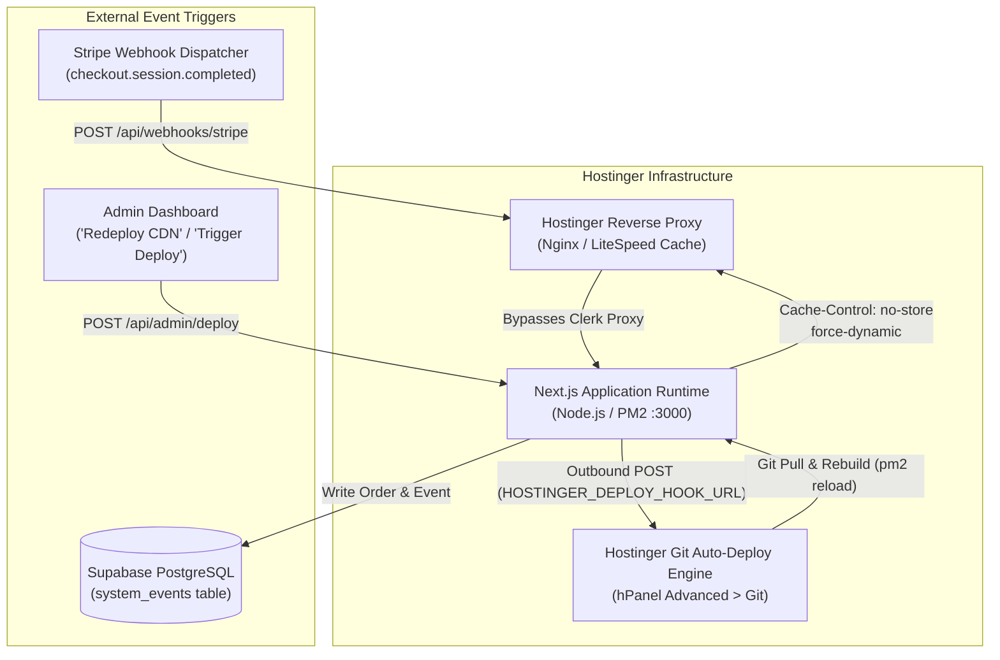

### Key Deployment Requirements on Hostinger:
1. **Auto-Deploy Webhook (`HOSTINGER_DEPLOY_HOOK_URL`)**:
   In Hostinger hPanel > Advanced > Git, copy the Auto-Deployment Webhook URL and add it to your environment variables as `HOSTINGER_DEPLOY_HOOK_URL`. When triggered in the Admin panel, the server pings Hostinger to pull the repository and rebuild.
2. **Reverse Proxy & Trailing Slashes**:
   Ensure Hostinger's Nginx/LiteSpeed does not issue `301/302` redirects for `/api/webhooks/*` (which drops POST body payloads). Inbound webhooks bypass Clerk middleware in [`src/proxy.ts`](file:///c:/Users/stnoo/Downloads/EternalsStudio/src/proxy.ts).
3. **Cache Busting**:
   All live data routes (`/api/admin/data`, `/api/admin/site-content`, `/api/webhooks/*`) export `dynamic = 'force-dynamic'` and `revalidate = 0` with `Cache-Control: no-store` headers to prevent Hostinger reverse proxies from serving stale responses.
4. **Database Connectivity**:
   Ensure `NEXT_PUBLIC_SUPABASE_URL` resolves to an active Supabase project. If the Supabase project is paused or deleted, event logs cannot be persisted to the database and will fall back to local server logs.

